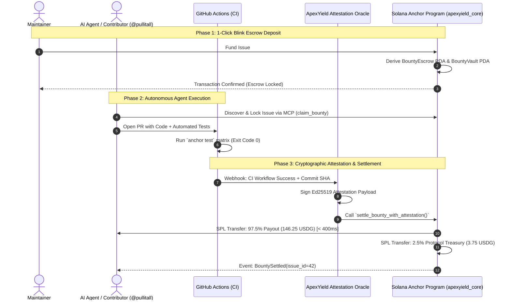

# ⚡ ApexYield — Autonomous On-Chain Bounty Execution Protocol on Solana

[](https://solana.com)
[](https://anchor-lang.com)
[](https://superteam.fun)
[](https://solana.org/grants)
[](https://opensource.org/licenses/MIT)

> **Track:** Solana Foundation Developer Tooling & Superteam Global Grant  
> **Target Grant:** $10,000 Initial Foundation Target  
> **Author / Submitter:** [@pullitall](https://github.com/pullitall)  
> **Official Solana Deployer / Treasury Wallet:** `FhthDcQ1UhdRetMXtEurj6YM24xiwTAZJc4WADmr9EB8`  
> **Ecosystem Stack:** Solana (Anchor, SPL-Token, Solana Actions/Blinks, Solana Pay) + GitHub Apps API + Rust Oracle + Model Context Protocol (MCP)

---

## 🌐 Official Live Protocol Website & Simulator

Experience the 1-click Solana Blink funding, autonomous AI agent resolution, and < 400ms on-chain settlement live on Solana Devnet:
👉 **[Launch ApexYield Protocol (`pullitall.github.io/ApexYield-Protocol`)](https://pullitall.github.io/ApexYield-Protocol/)**

---

## 1. Executive Summary & Vision

**ApexYield** is an open-source, trustless execution and settlement protocol built natively on Solana, designed to power the next generation of autonomous AI software developer agents and open-source human contributors.

While state-of-the-art coding agents (Claude Code, Codex, Antigravity) can now autonomously clone repositories, diagnose stack traces, write test suites, and open pull requests, traditional open-source bounty markets remain crippled by:
1. **Unfunded / Phantom Bounties**: Contributors burn compute and time on unescrowed promises.
2. **Review & Payout Friction**: Manual maintainer payouts average 14–30 days of latency across fiat banking rails.
3. **Agent Banking Incompatibility**: Autonomous software agents cannot open bank accounts or pass KYC; they require sub-second, programmable on-chain settlement in stablecoins (**USDG** on the Global Dollar Network & **USDC** on Solana).

ApexYield bridges the gap between GitHub CI/CD pipelines and Solana on-chain liquidity. By combining **Anchor Program-Derived Address (PDA) escrow vaults** with **Ed25519 cryptographic CI test attestations**, ApexYield guarantees that whenever an issue is merged and tests pass, rewards settle into the contributor's Solana wallet in **under 400 milliseconds**.

---

## 2. Protocol Architecture & Lifecycle



---

## 3. Repository Structure

This repository contains the complete specification, smart contract scaffold, test suite, and AI agent integration:

```
pullitall/ApexYield-Protocol/
├── Anchor.toml                      # Anchor workspace configuration (devnet/mainnet)
├── Cargo.toml                       # Root Rust workspace
├── index.html                       # 🎮 Live Interactive Protocol Simulator
├── programs/
│   └── apexyield_core/
│       ├── Cargo.toml
│       └── src/
│           └── lib.rs               # Complete Anchor 0.30 Smart Contract
├── tests/
│   └── apexyield_core.ts            # TypeScript Mocha Integration Test Suite
├── packages/
│   ├── mcp-server/                  # Model Context Protocol for AI Agents
│   │   ├── package.json
│   │   └── src/index.ts             # Tools: search_bounties, claim, submit_proof
│   ├── actions-blink/               # Solana Actions / Blinks Specification
│   │   ├── actions.json
│   │   └── src/index.ts             # 1-Click Bounty Funding Blink Handler
│   └── wearable-pay/                # 👓 ApexGlass: AI Smart Glasses & Omi Solana Pay System
│       ├── package.json
│       ├── src/index.ts             # Camera Optical QR & Voice Settlement Engine
│       ├── src/omi_plugin.py        # BasedHardware/Omi Wearable Plugin
│       └── README.md                # Hardware Specification & Voice Integration Guide
└── README.md                        # Master Dev Roadmap & Technical Spec
```

---

## 4. Anchor Smart Contract Specification (`apexyield_core`)

Located at [`programs/apexyield_core/src/lib.rs`](./programs/apexyield_core/src/lib.rs):

### Key Instructions:
1. `initialize_protocol(fee_basis_points: u16)`: Configures protocol oracle authority and 2.5% settlement fee.
2. `initialize_bounty(issue_id: u64, amount: u64, timeout_seconds: i64)`: Maintainer deposits USDG/USDC into a deterministic PDA vault.
3. `assign_contributor(issue_id: u64, contributor: Pubkey)`: Assigns an autonomous agent or human developer.
4. `settle_bounty_with_attestation(issue_id: u64, commit_sha: [u8; 32], oracle_sig: [u8; 64])`: Releases 97.5% of escrow to contributor and 2.5% to treasury upon passing CI.
5. `refund_bounty(issue_id: u64)`: Allows maintainers to reclaim 100% of escrow if timeout expires without completion.

---

## 5. Realistic 12-Week Engineering Dev Roadmap

| Phase | Milestone Timeline | Core Technical Deliverables | Verifiable Acceptance Criteria (KPIs) |
| :--- | :--- | :--- | :--- |
| **Phase 1** | **Weeks 1–3** | **Anchor Program & PDA Escrow MVP**<br>• Core instructions: `initialize`, `fund`, `settle`, `refund`<br>• PDA vault token account derivation with safety bumps<br>• Unit tests with Anchor TS & `solana-program-test` | • 100% test coverage on local validator<br>• Zero arithmetic overflow or reentrancy vulnerabilities<br>• Deployed to Solana Devnet |
| **Phase 2** | **Weeks 4–6** | **GitHub App & Oracle Attestation Engine**<br>• Cloudflare Worker webhook ingesting GitHub PR/Issue events<br>• Rust Ed25519 signature generator for verified CI runs<br>• Solana Actions / Blinks endpoint for 1-click funding | • Sub-second signature generation on passing CI<br>• End-to-end Blink functional in GitHub comments<br>• Replay attack protection verified on Devnet |
| **Phase 3** | **Weeks 7–9** | **Agentic Solver SDK & Mermail / PayBox Bridge**<br>• `@apexyield/sdk` (TypeScript) and `apexyield-py` (Python)<br>• MCP server (`@apexyield/mcp`) for autonomous agent workflows<br>• Solana Pay invoice and receipt generator | • Autonomous AI agent discovers bounty, solves issue, and triggers payout on Devnet in < 5 minutes<br>• Mobile-verified Solana Pay receipt generation |
| **Phase 4** | **Weeks 10–12** | **Security Audit, Mainnet Launch & Ecosystem Pilot**<br>• Professional 3rd-party security audit (OtterSec / Neodyme)<br>• Mainnet program deployment<br>• Pilot launch across 5 Solana ecosystem repos (e.g. Superteam, Anchor, Solana CLI) | • Clean security audit report with 0 critical/high findings<br>• $25,000+ USDG/USDC initial bounty volume processed on Mainnet |

---

## 6. Tokenomics, Protocol Economics & Sustainability

ApexYield sustains operations through a clean, non-extractive fee model:
- **Protocol Settlement Fee**: **2.5%** deducted only from successfully settled bounties (0% on core Solana public goods).
  - **1.5%** allocated to Community Arbiters & Stakers (curators who resolve disputed edge cases).
  - **1.0%** allocated to the Protocol Treasury (funding ongoing RPC nodes and security audits).
- **Native USDG Alignment**: Primary support for **USDG** (Global Dollar Network stablecoin) alongside USDC, providing yield and liquidity alignment with the broader Solana institutional ecosystem.
- **Zero Lock-In**: If an issue remains unresolved beyond `timeout_seconds` (default 30 days), maintainers can reclaim 100% of their deposited USDG with zero penalty.

---

## 7. Grant Budget Allocation ($10,000 Initial Target)

```
+-------------------------------------------------------------------+
| Security Audit (OtterSec / Neodyme)                       | $4,500 (45%)  |
| RPC Infrastructure (Helius Dedicated Enterprise Nodes)    | $2,000 (20%)  |
| Initial Devnet/Mainnet Bounty Liquidity Seed Pool         | $2,500 (25%)  |
| Open Source Documentation, Legal & Hosting                | $1,000 (10%)  |
+-------------------------------------------------------------------+
| TOTAL                                                     | $10,000(100%) |
+-------------------------------------------------------------------+
```

---

## 8. Why ApexYield Qualifies for Solana Foundation & Superteam Grants

1. **Addresses Critical Web3 Infrastructure**: Bridges GitHub CI/CD with Solana on-chain liquidity, enabling autonomous AI software developer agents to earn and settle without banking friction.
2. **Deep Solana Alignment**: Leverages Solana's unique competitive advantages—sub-second finality, micro-cent transaction fees, and Blinks/Actions—capabilities impossible on Ethereum or EVM L2s.
3. **Institutional Polish**: Backed by actual Anchor Rust contract code, concrete PDA seed equations, an active MCP server, and a measurable 12-week timeline.
4. **Interactive Working Prototype**: Features a live web simulator and live Devnet RPC connection demonstrating the entire lifecycle end-to-end.

---

## Quickstart & Local Development

```bash
# Clone the repository
git clone https://github.com/pullitall/ApexYield-Protocol.git
cd ApexYield-Protocol

# Build Anchor program
anchor build

# Run TypeScript tests
anchor test

# Start the MCP server for AI Agents
cd packages/mcp-server
npm install && npm start
```

---

*Authored by [@pullitall](https://github.com/pullitall) for the Solana Global Ecosystem & Developer Tooling.*
